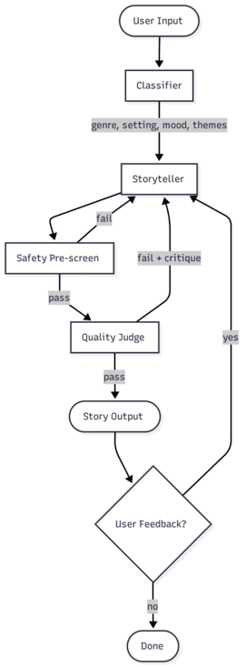

# Bedtime Story Generator -OnceUpon

An LLM-powered CLI that turns a one-line request into a polished, age-appropriate bedtime story through a multi-stage prompt pipeline with automated quality control.

## Architecture

<div align="center">
  
</div>

## How It Works

1. **Gather Context** — interactive prompts collect the child's name, age, preferred tone, length, and an optional moral/theme.
2. **Classify** — an LLM extracts structured story attributes (genre, setting, characters, mood, themes) from the free-text request.
3. **Generate** — a storyteller prompt built on three-act structure and sensory-first writing produces the draft.
4. **Pre-screen** — a fast binary safety gate catches hard violations (violence, scary imagery, sad endings) before the heavier judge runs.
5. **Judge** — scores the story on four axes (age-appropriateness, story arc, engagement, safety). Stories that don't clear the threshold are rewritten with the judge's critique injected back into the prompt (up to 3 retries), keeping the best-scoring draft as a fallback.
6. **Feedback loop** — the user can request changes ("make it funnier", "add a dragon"), which feed back into generation.

## Prompt Design Highlights

- **Structured extraction over free-form classification** — the classifier returns typed JSON, giving the storyteller concrete attributes instead of vague labels.
- **Critique-driven retry** — the judge's per-dimension critique is fed verbatim into the next generation pass, so each retry is targeted rather than random.
- **Layered safety** — a cheap binary pre-screen runs before the expensive multi-dimension judge, saving tokens on obviously unsafe drafts.
- **Persona-based system prompts** — each LLM call has a distinct role (librarian, author, safety reviewer, editor) with explicit output format contracts, reducing hallucination and format drift.

## Engineering Details

- **Exponential backoff with retry** — API calls retry up to 3× on rate-limit, connection, and timeout errors with exponential wait (`2^attempt` seconds), avoiding cascading failures.
- **Fail-open JSON parsing** — every LLM-as-JSON call has a fallback: if the model returns malformed output, the pipeline continues with safe defaults instead of crashing.
- **Best-of-N selection** — the judge loop tracks the highest-scoring draft across all attempts, so even if no story clears the pass threshold, the user gets the best one generated.
- **Lazy client init** — the OpenAI client is instantiated once on first use (singleton pattern), avoiding unnecessary connections if the script exits early.
- **Input clamping** — child age is clamped to `[5, 10]` at input time, preventing prompt injection of extreme ages that would confuse the storyteller.

## Quickstart

```bash
git clone <repo-url> && cd <repo>
pip install -r requirements.txt
echo 'OPENAI_API_KEY=sk-...' > .env
python main.py
```

## What I'd Build Next (2 more hours)

- **Streaming output** — token-by-token display so the story "types itself" on screen.
- **TTS delivery** — call `openai.audio.speech.create()` with a warm voice to read the story aloud.
- **Session memory** — persist child preferences to a local JSON file for sequels across runs.
